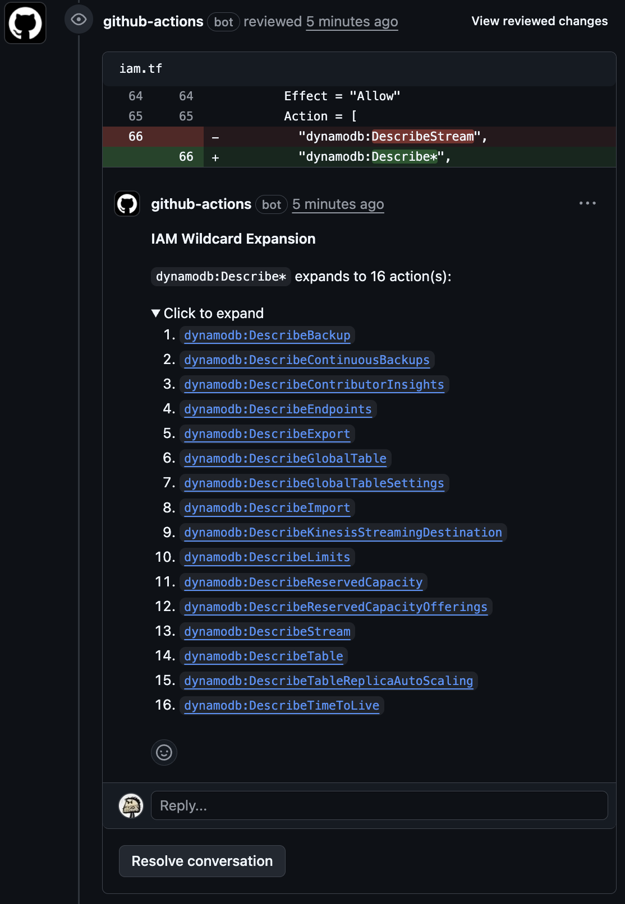

# Expand AWS IAM Wildcards

[](https://github.com/thekbb/expand-aws-iam-wildcards/actions/workflows/ci.yml)
[](https://codecov.io/gh/thekbb/expand-aws-iam-wildcards)
[](https://opensource.org/licenses/MIT)

Automatically expands IAM wildcard actions in PR diffs and posts inline comments showing what
each wildcard matches, with links to AWS docs.

The goal is to make it easier and faster for reviewers to understand changes to security posture with inline comments
like this:



## Quick Start

```yaml
# .github/workflows/iam-wildcards.yml
name: Expand IAM Wildcards
on: [pull_request]

permissions:
  pull-requests: write

jobs:
  expand:
    runs-on: ubuntu-latest
    steps:
      - uses: thekbb/expand-aws-iam-wildcards@v1
```

That's it. When a PR adds `s3:Get*`, reviewers see an inline comment listing every matching action with links to AWS documentation.

## What It Does

When your PR introduces:

```hcl
"s3:Get*Tagging",
```

The action posts an inline comment:

> **IAM Wildcard Expansion**
>
> `s3:Get*Tagging` expands to 5 action(s):
>
> 1. [`s3:GetBucketTagging`](https://docs.aws.amazon.com/service-authorization/latest/reference/list_amazons3.html)
> 2. [`s3:GetJobTagging`](https://docs.aws.amazon.com/service-authorization/latest/reference/list_amazons3.html)
> 3. [`s3:GetObjectTagging`](https://docs.aws.amazon.com/service-authorization/latest/reference/list_amazons3.html)
> 4. [`s3:GetObjectVersionTagging`](https://docs.aws.amazon.com/service-authorization/latest/reference/list_amazons3.html)
> 5. [`s3:GetStorageLensConfigurationTagging`](https://docs.aws.amazon.com/service-authorization/latest/reference/list_amazons3.html)

Consecutive wildcards are grouped into a single comment. Expanded actions link to AWS documentation.

## Inputs

| Name                  | Description                                          | Default                         |
| --------------------- |------------------------------------------------------| ------------------------------- |
| `github-token`        | GitHub token for API access                          | `${{ github.token }}`           |
| `file-patterns`       | Glob patterns to scan (comma-separated)              | See below                       |
| `collapse-threshold`  | Number of actions before collapsing into `<details>` | `5`                             |

Default file patterns: `**/*.json,**/*.yaml,**/*.yml,**/*.tf,**/*.ts,**/*.js`

## Usage Examples

### Terraform Only

```yaml
- uses: thekbb/expand-aws-iam-wildcards@v1
  with:
    file-patterns: '**/*.tf'
```

### CloudFormation Only

```yaml
- uses: thekbb/expand-aws-iam-wildcards@v1
  with:
    file-patterns: '**/*.yaml,**/*.yml,**/*.json'
```

### Higher Collapse Threshold

```yaml
- uses: thekbb/expand-aws-iam-wildcards@v1
  with:
    collapse-threshold: '10'
```

## How It Works

1. Fetches the PR diff
2. Scans added lines for IAM wildcard patterns (`service:Action*`)
3. Expands wildcards using [@cloud-copilot/iam-expand](https://github.com/cloud-copilot/iam-expand)
4. Posts inline review comments with links to AWS docs

## Security & Trust

- **Minimal permissions** - only needs `pull-requests: write`
- **No secrets required** - uses default `github.token`
- **No external calls** - IAM data bundled at build time (automatically updated weekly)
- **Auditable** - ~500 lines of TypeScript, `dist/index.js` committed

For tighter control, fork the repo or pin to a full semver or SHA.
With a fork, you have complete control and can choose when or if you update.

```yaml
uses: thekbb/expand-aws-iam-wildcards@v1.1.4
```

```yaml
uses: thekbb/expand-aws-iam-wildcards@daedd61e3
```

## Contributing

See [CONTRIBUTING.md](CONTRIBUTING.md) for development setup.

## Credits

Uses [@cloud-copilot/iam-expand](https://github.com/cloud-copilot/iam-expand) for wildcard expansion.
